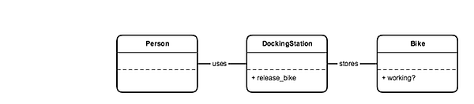

# Learning Objective

### Extract a Domain Model from User Stories

Given the user stories:
```
As a person,
So that I can use a bike,
I'd like a docking station to release a bike.
```
```
As a person,
So that I can use a good bike,
I'd like to see if a bike is working
```
It is interesting to represent the following domain model:



A domain model is a system of abstractions that describes selected aspects of a project and helps contribution and interaction within it.
